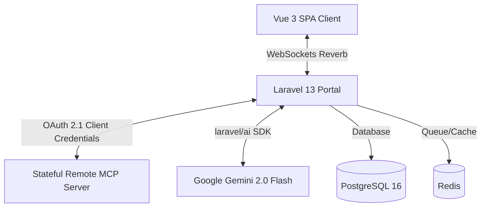

# MCPHost Gateway

MCPHost Gateway is a high-performance, secure, stateful, and **100% self-hosted** multimodal AI gateway and client portal built using **Laravel 13** and **Vue 3 + Inertia SPA**. It seamlessly handshakes with remote Model Context Protocol (MCP) servers via OAuth 2.1 and streams execution steps in real-time using WebSockets.

---

## 🏗️ Architecture



- **Core Framework**: Laravel 13 (PHP 8.3+) with Vue 3 & Inertia SPA.
- **AI Orchestrator**: Official first-party **`laravel/ai` SDK** mapping dynamic remote tool functional declarations.
- **Dynamic remote tools wrapper**: `DynamicMcpTool` invoking tool requests via secured, stateful Streamable HTTP handshakes.
- **Self-Hosted WebSockets**: Powered by **Laravel Reverb** instead of third-party SaaS services.
- **Local Parity Storage**: PostgreSQL 16 & Redis Alpine booted via isolated Docker Compose.
- **Clean Standards & Formatting**: Enforced globally using **Laravel Pint**.

---

## ⚡ Development Setup (Local)

We have provided a super-friendly bash script that spins up PostgreSQL, Redis, Vite, Laravel serving, Reverb WebSocket listeners, and the Artisan Queue worker concurrently in a single command.

### 1. Configure your `.env`
Copy the example environment configuration:
```bash
cp .env.example .env
```
Ensure you provide a valid `GEMINI_API_KEY` (if absent, the portal runs in an extremely premium local simulated mock mode so you can test all features).

### 2. Boot all services
Simply run our development script:
```bash
./start-dev.sh
```
Press `Ctrl+C` at any time to cleanly stop all concurrent services and background jobs.

---

## 🐳 Production Deployment (Coolify)

For Coolify and staging/production clusters, we have decoupled and isolated the docker setup under `/docker` to enforce rolling zero-downtime updates:

- **Dockerfile**: [docker/Dockerfile](file:///docker/Dockerfile) uses a two-stage rolling container build:
  1. Compiles frontend assets via Bun.
  2. Runs high-performance PHP 8.3 FPM & Nginx container for ultimate speed.
- **Entrypoint**: [docker/entrypoint.sh](file:///docker/entrypoint.sh) supports automated migrations on boot if the environment variable `RUN_MIGRATIONS=true` is set.

To deploy on Coolify:
1. Connect your GitHub repository.
2. Select **Dockerfile** as the build pack.
3. Set the Dockerfile path to `docker/Dockerfile`.
4. Configure database and Redis connection variables.

---

## 💎 Premium UI Features

- **Multimodal Visual Attachments**: Drag-and-drop or select multiple images with instant thumbnails and removal previews.
- **MCP Execution Stepper**: Stateful accordion displaying real-time tools running, parameters, and collapsible raw JSON responses.
- **100% Self-Hosted Charts**: Real-time analytical widgets built purely via custom HTML/SVG responsive elements to keep data private.
